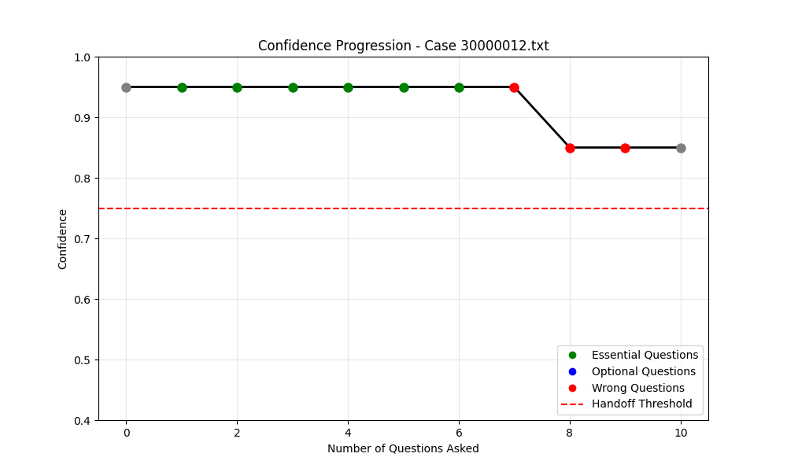
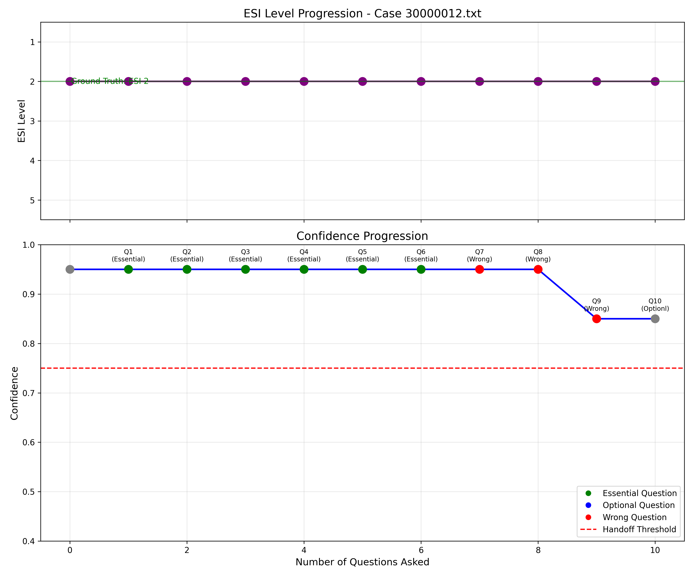
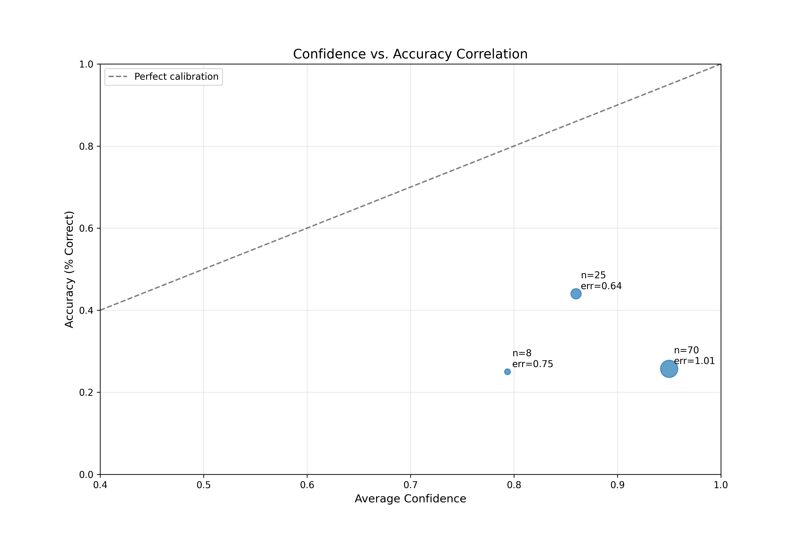

# Medical Triage LLM Confidence Analysis

This project explores using local LLMs (via Ollama) to assign Emergency Severity Index (ESI) levels, reason about handoff risk, and study confidence calibration. It ships with two runnable flows:
- A newer confidence-elicitation and evaluation pipeline in `src/` built around annotated XML cases.
- A legacy LangChain-based triage and recommendation system in the repository root for plain-text cases.

## Features
- ESI prediction with risk-factor extraction using a local Ollama model (`mistral` by default) in `src/triage_system.py`.
- Incremental QA-based confidence tracking plus enhanced elicitation strategies (vanilla, CoT, self-probing, top-k, misleading/paraphrased prompts, multiple sampling/aggregation schemes) in `src/extended_confidence_analyzer.py` and `src/eval/`.
- Calibration and error visualizations: progression plots, reliability diagrams, confidence distributions, and performance tables.
- Evaluation metrics (accuracy, handoff rates, ESI distribution) and per-case JSON reports.
- Legacy enhanced triage system with handoff analysis, diagnosis suggestions, and structured recommendations (`enhanced_triage_system.py`, `triage_evaluation.py`, `run_enhanced_triage.py`).

## Requirements
- Python 3.10+.
- Ollama running locally with the `mistral` model pulled (`ollama pull mistral`; default endpoint `http://localhost:11434`).
- Python packages: `requests`, `numpy`, `pandas`, `matplotlib`, `seaborn`, `scipy`, `langchain`, `langchain-ollama`.

Install the Python dependencies (no pinned lockfile is provided):
```bash
pip install requests numpy pandas matplotlib seaborn scipy langchain langchain-ollama
```

## Data
- Annotated cases for the confidence/evaluation pipeline live in `data/annotated_cases/*.txt.xml`.
- Each file contains a `<TEXT>` block with structured sections separated by `====` (chief complaint, visit summary, history, QA pairs, ER visit info) and `<TAGS>` with labels such as:
  - `ESI` (attribute `ESI_LEVEL`) for ground-truth acuity.
  - `QA` tags with `relevance`/`comment` attributes that drive the incremental-question ordering.
- Add new cases by dropping more `.txt.xml` files into the folder; they are discovered automatically.

## Quick start (confidence elicitation pipeline)
1) Start Ollama and ensure the model is available: `ollama serve` in another terminal.
2) From the repo root, process the annotated set (limit to N cases with `--max-cases`):
```bash
python src/main.py --data-dir data/annotated_cases --max-cases 5
```
3) The script will:
   - Parse each XML case (`utils.parse_xml_case`), extract structured fields, and build QA relevance ordering.
   - Call the LLM to predict ESI, track confidence as more QA pairs are revealed, and run elicitation strategies.
   - Score predictions against ground truth (`evaluation_pipeline.py`) and emit reports/plots.

## Outputs
- `output/reports/evaluation_report.json`: aggregate metrics (accuracy, accuracy within one level, ESI distribution, handoff rate).
- `output/reports/confidence_summary.json`: summary of confidence progression across cases.
- `output/reports/<case_id>_detailed.json`: per-case evaluation plus incremental/elicitation confidence data.
- `output/confidence_analysis/<case_id>_progression.png`: confidence over incremental QA for each case.
- `output/visualizations/confidence_elicitation/**`: distribution plots, reliability/error analyses, and performance tables for each elicitation strategy (path varies by strategy).
- Additional progression/calibration plots are written under `output/visualizations/` by the analyzers.

## Sample visuals (from `output/`)
Confidence progression for a single case as more QA pairs are revealed:


Enhanced ESI + confidence overlay for the same case:


Overall calibration vs accuracy across cases:


## Module map
- `src/triage_system.py`: Minimal Ollama client, medical case parser, risk-factor detection, and regex-based ESI/confidence extraction.
- `src/confidence_analyzer.py`: Incremental QA ordering, confidence progression tracking, and summary reporting/plots.
- `src/extended_confidence_analyzer.py`: Confidence elicitation strategies (prompting, sampling, aggregation) with calibration visualizations and performance tables.
- `src/eval/prompting_strategies.py`: Prompt templates and response parsers (vanilla, CoT, self-probing, multi-step, top-k).
- `src/eval/sampling_strategies.py`: Self-random, misleading, and paraphrasing samplers.
- `src/eval/aggregation_strategies.py`: Consistency, average-confidence, and pair-rank aggregators.
- `src/evaluation_pipeline.py`: Computes accuracy/handoff metrics and writes evaluation reports.
- `src/utils.py`: XML parsing and output-directory helpers.
- Legacy pipeline (plain-text cases): `TriageSystem.py` (LangChain/Ollama baseline), `enhanced_triage_system.py` (handoff analysis, diagnoses, structured recs), `triage_evaluation.py` plus runners `run_enhanced_triage.py`, `run_evaluation.py`, and `Test.py`.

## Legacy pipeline usage
These scripts expect plain-text cases (not XML) and have hard-coded demo paths; edit `data_dir` in the file before running.
```bash
python run_enhanced_triage.py   # batch evaluation with enhanced system
# or
python run_evaluation.py        # comparison/metrics; uses the same enhanced system by default
```

## Customization tips
- Change the Ollama model or endpoint in `src/triage_system.py` (`api_base`, `model` payload) or subclass `TriageSystem`.
- Add/adjust prompting, sampling, or aggregation strategies under `src/eval/` and reference them from `ExtendedConfidenceAnalyzer.analyze_case_with_elicitation`.
- Tweak maximum cases (`--max-cases`), output directories (`ensure_output_dirs`, analyzer `output_dir`), or risk-factor lists to fit new datasets.

## Notes
- The code is research/prototyping oriented and is **not** a clinical decision tool.
- See `LICENSE` (MIT) for licensing details.
